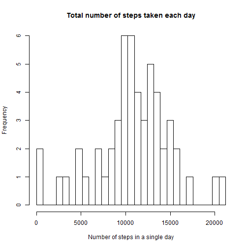
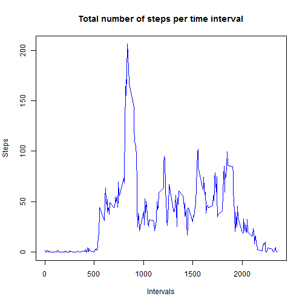
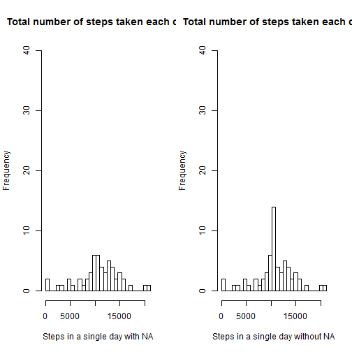
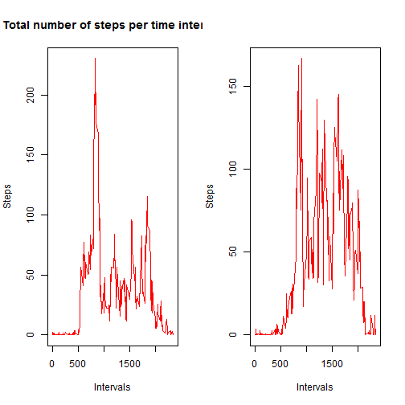

title: "Reproducible Research: Peer Assessment 1"
Author: "Inigo AZqueta"
output: html_document

## Loading and preprocessing the data


```r
setwd("C:/Users/inigo/Desktop/COURSERA/Data Science/05 Reproducible Research/01Assigment/repdata-data-activity")
activity_data<-read.csv("C:/Users/inigo/Desktop/COURSERA/Data Science/05 Reproducible Research/01Assigment/repdata-data-activity/activity.csv", header=TRUE)
```
## What is mean total number of steps taken per day?
in
### 1. Calculate the total number of steps taken per day
We must calculate the number of steps taken per day. Hence, for each day, the object "date" of the 
table remains constant. The function aggregate is useful to perform a sum of the variable steps, grouped by the variable "date"


```r
steps_day<-aggregate(steps~date, activity_data, sum)
head(steps_day)
```

```
##         date steps
## 1 2012-10-02   126
## 2 2012-10-03 11352
## 3 2012-10-04 12116
## 4 2012-10-05 13294
## 5 2012-10-06 15420
## 6 2012-10-07 11015
```

```r
tail(steps_day)
```

```
##          date steps
## 48 2012-11-24 14478
## 49 2012-11-25 11834
## 50 2012-11-26 11162
## 51 2012-11-27 13646
## 52 2012-11-28 10183
## 53 2012-11-29  7047
```

### 2. Make a histogram of the total number of steps taken each day
Hist() produces a plot of grouped values of the number of steps taken each day. There are 30 bins.


```r
hist(steps_day$steps, breaks=seq(0, max(steps_day$steps), l=30), main="Total number of steps taken each day", xlab="Number of steps in a single day")
```

 
###3.Calculate and report the mean and median of the total number of steps taken per day
The summary() function provides descriptive statistics for our variable steps

```r
summary(steps_day$steps)
```

```
##    Min. 1st Qu.  Median    Mean 3rd Qu.    Max. 
##      41    8841   10760   10770   13290   21190
```
## What is the dail activity pattern
### 1. Make a time series plot (i.e. type = "l") of the 5-minute interval (x-axis) and the average number of steps taken, averaged across all days (y-axis)

Using the aggregate funtion, we can get the mean number of steps taken per each interval.
Then the average number of steps can be plotted against the interval number


```r
steps_interval<-aggregate(steps~interval, activity_data, mean)
ts_plot<-plot(steps_interval$steps ~ steps_interval$interval, type="l", col="blue", axes=T, xlab="Intervals", ylab="Steps", main="Total number of steps per time interval")
```

 

```r
ts_plot
```

```
## NULL
```

### 2. Which 5-minute interval, on average across all the days in the dataset, contains the maximum number of steps?


```r
interval_with_max_steps <- steps_interval[which.max(steps_interval$steps),]
interval_with_max_steps
```

```
##     interval    steps
## 104      835 206.1698
```

## Imputing missing values
### 1. Calculate and report the total number of missing values in the dataset (i.e. the total number of rows with NAs)
We count the number of rows that have a missing value. By using two variables, one to store all the rows with missing values, and another one to store the number of those rows, we ensure that we can work with the rows of missing values in the future, enabling the possibility to remove those rows from our data in the future.


```r
NA_rows<-activity_data[is.na(activity_data$steps), 1]
missing<-sum(NA_rows)
```

### 2. Devise a strategy for filling in all of the missing values in the dataset. The strategy does not need to be sophisticated.
### 3. Create a new dataset that is equal to the original dataset but with the missing data filled in.

We use the mean calculated with the aggregate in the previous task.
activity_data_filled is now our new dataset with the filled in values


```r
activity_data_filled<- activity_data
activity_data_filled$steps[is.na(activity_data$steps)]<-steps_interval$step
head(activity_data_filled)
```

```
##       steps       date interval
## 1 1.7169811 2012-10-01        0
## 2 0.3396226 2012-10-01        5
## 3 0.1320755 2012-10-01       10
## 4 0.1509434 2012-10-01       15
## 5 0.0754717 2012-10-01       20
## 6 2.0943396 2012-10-01       25
```

###4.Make a histogram of the total number of steps taken each day.  Do these values differ from the estimates from the first part of the assignment? 
###What is the impact of imputing missing data on the estimates of the total daily number of steps?


```r
steps_day_filled<-aggregate(steps~date, activity_data_filled, sum)

par(mfcol = c(1, 2))

hist(steps_day$steps, ylim = range(0:40),breaks=seq(0, max(steps_day$steps), l=30), main="Total number of steps taken each day", xlab="Steps in a single day with NA")
filled_hist<-hist(steps_day_filled$steps,ylim = range(0:40), breaks=seq(0, max(steps_day_filled$steps), l=30), main="Total number of steps taken each day", xlab="Steps in a single day without NA")
```

 

### Calculate and report the mean and median total number of steps taken per day.
summary() functions gives an overview of all the arguements on our dataset, includingmean and median


```r
summary(steps_day_filled$steps)
```

```
##    Min. 1st Qu.  Median    Mean 3rd Qu.    Max. 
##      41    9819   10770   10770   12810   21190
```

## Are there differences in activity patterns between weekdays and weekends?

###1.Create a new factor variable in the dataset with two levels - "weekday" and "weekend" indicating whether a given date is a weekday or weekend day. 


```r
library(timeDate)
```

```
## Warning: package 'timeDate' was built under R version 3.2.0
```

```r
activity_data_filled$weekday<-isWeekday(activity_data_filled$date, wday = 1:5)

activity_data_filled$weekday[activity_data_filled$weekday==TRUE]<-"weekday"
activity_data_filled$weekday[activity_data_filled$weekday==FALSE]<-"weekend"

activity_data_filled$weekday<-factor(activity_data_filled$weekday)

head(activity_data_filled)
```

```
##       steps       date interval weekday
## 1 1.7169811 2012-10-01        0 weekday
## 2 0.3396226 2012-10-01        5 weekday
## 3 0.1320755 2012-10-01       10 weekday
## 4 0.1509434 2012-10-01       15 weekday
## 5 0.0754717 2012-10-01       20 weekday
## 6 2.0943396 2012-10-01       25 weekday
```

```r
table(activity_data_filled$weekday)
```

```
## 
## weekday weekend 
##   12960    4608
```

###2.Make a panel plot containing a time series plot of the 5-minute interval (x-axis) and the average number of steps taken, averaged across all weekday days or weekend days (y-axis). 


```r
steps_interval <- aggregate(steps ~ interval+weekday, activity_data_filled, mean)

par(mfcol = c(1, 2))

plot_weekday<-plot(steps_interval$steps[steps_interval$weekday=="weekday"] ~ steps_interval$interval[steps_interval$weekday=="weekday"], type="l", col="red", axes=T, xlab="Intervals", ylab="Steps", main="Total number of steps per time interval")
```

```
## Warning in plot(steps_interval$steps[steps_interval$weekday == "weekday"]
## ~ : bytecode version mismatch; using eval
```

```r
plot_weekend<-plot(steps_interval$steps[steps_interval$weekday=="weekend"] ~ steps_interval$interval[steps_interval$weekday=="weekend"], type="l", col="red", axes=T, xlab="Intervals", ylab="Steps")
```

 
It is clearly seen that the person moves more during the weekdays than during the weekend.


